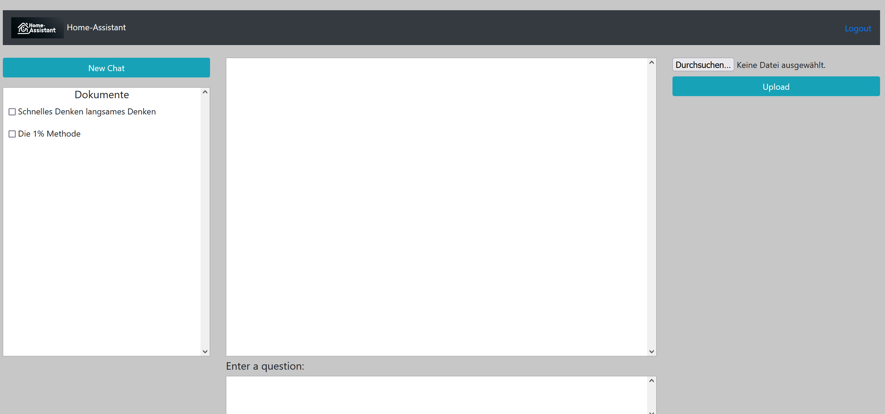

<a id="readme-top"></a>

<br />
<div align="center">
<h1 align="center">Rag-Chat-UI</h1>
</div>

<details>
  <summary>Table of Contents</summary>
  <ol>
    <li>
      <a href="#about-the-project">About The Project</a>
      <ul>
        <li><a href="#built-with">Built With</a></li>
      </ul>
    </li>
    <li>
      <a href="#getting-started">Getting Started</a>
      <ul>
        <li><a href="#prerequisites">Prerequisites</a></li>
        <li><a href="#installation">Installation</a></li>
      </ul>
    </li>
    <li><a href="#usage">Usage</a></li>
    <li><a href="#roadmap">Roadmap</a></li>
    <li><a href="#contributing">Contributing</a></li>
    <li><a href="#license">License</a></li>
  </ol>
</details>

## About The Project

Rag-Chat-UI is a user interface developed to communicate with a backend API (`rag_assistant_api`). It allows users to submit both text and voice inputs, which are then forwarded to a language model to generate responses. The UI supports various features such as user authentication, document uploads, and displaying context-aware responses from the language model.



This project is only one part of the bigger Home-Assitant-Project, which consists of the two other repositories [Rag-Assistant-API](https://github.com/HerbiHerb/rag_assistant_api), [Speech-2-Text](https://github.com/HerbiHerb/speech_2_text) [Rag-Assistant-Start](https://github.com/HerbiHerb/rag_assistant_start). 

<p align="right">(<a href="#readme-top">back to top</a>)</p>

### Built With

* [](https://www.python.org)

<p align="right">(<a href="#readme-top">back to top</a>)</p>

## Getting Started

To get the project up and running locally, follow these steps.

### Prerequisites

- Python 3.9 or higher
- `pip` or `poetry` for managing Python packages
- Docker (optional for containerized deployment)

### Installation

1. Clone the repository:
   ```sh
   git clone https://github.com/HerbiHerb/rag_chat_ui.git
   cd rag_chat_ui
   ```

2. Install dependencies:

    With pip:
    ```sh
    pip install -r requirements.txt
    ```
    With poetry:
    ```sh
    poetry install
    ```
3. Create the .env file with the following variables in there:
    CONFIG_FP = path to the config.yaml file
    OPENAI_API_KEY = openai key for the speech to text functionality
4. Configure the application:
    Edit the config/config.yaml file according to your requirements.
    Ensure that the environment variable CONFIG_FP points to this file.
5. Run the application:
    ```sh
    python -m src.chat_ui.main
    ```
<p align="right">(<a href="#readme-top">back to top</a>)</p>

### Usage

Once installed and configured, the application can be accessed via your browser at http://localhost:5001. Users can log in, upload documents, and interact with the language model.
Features

* User Authentication: Secure access for registered users.
* Document Upload: Supports uploading .txt files to provide context for model responses.
* Text and Voice Input: Interact with the model using text or voice inputs.
* Source Display: Shows the sources used to generate responses.

<p align="right">(<a href="#readme-top">back to top</a>)</p>

### Roadmap

- [ ] Add tool selection into the ui (similar to document selection)
- [ ] Support for more file formats in uploads

<p align="right">(<a href="#readme-top">back to top</a>)</p>

### Contributing

Contributions are welcome! If you have suggestions for improving this project, please fork the repo and create a pull request. Alternatively, you can open an issue with the "enhancement" tag.

1. Fork the Project
2. Create a new Branch (git checkout -b feature/AmazingFeature)
3. Commit your Changes (git commit -m 'Add some AmazingFeature')
4. Push to the Branch (git push origin feature/AmazingFeature)
5. Open a Pull Request

<p align="right">(<a href="#readme-top">back to top</a>)</p>

### License

Distributed under the MIT License. See `LICENSE` for more information.

<p align="right">(<a href="#readme-top">back to top</a>)</p>